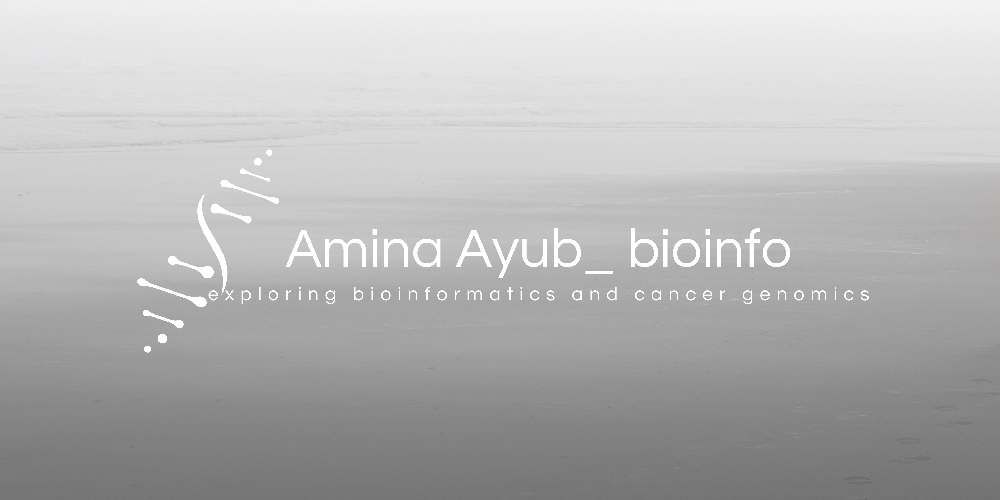

  

## Hi there 👋
I'm Amina, interested in uncovering biological signals hidden within genomic and transcriptomic data

<h2> Research Interests</h2>

  
  
  
  
  

##  Technical Skills

**Programming & Data Analysis**

**Bioinformatics & Computational Biology**

**Development & Computational Environment**

**Scientific Design & Visualization**

---

 ##  Featured Projects
1. RNA-seq Analysis https://github.com/amamina/GeneExpression_RNAseq_Analysis

2. Microarray Differential Expression Analysis https://github.com/amamina/GeneExpression_MicroArray_Analysis

3. Cancer Gene-Expression & Biomarker Analysis

4. Variant Pathogenicity Prediction https://github.com/amamina/Variant-Interpretation-Algorithms

5. Molecular Dynamics Simulation

6. VCF-Processing-Pipeline-R  https://github.com/amamina/VCF-Processing-Pipeline-R

---

